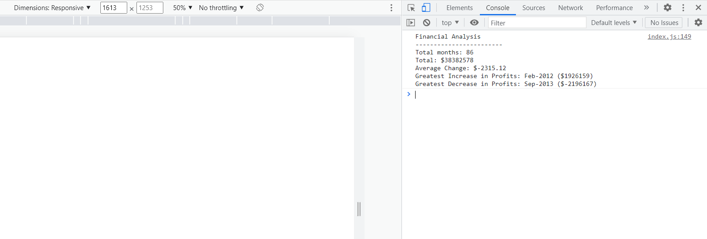

# Console Finances

## Description

The purpose of this project was to create algorithms in Javascript that would take an existing dataset of financial information and calculate the following from it:
- The total number of months
- The net total of the profits/losses over the entire period
- The average of the changes in profits/losses
- The greatest increase in profits
- The greatest decrease in losses

These values are then displayed in the console of the page.

[Click here](https://codenamehaylz.github.io/Console-Finances/) to see the deployed page.

## Usage

Right click anywhere on the deployed page and click 'inspect' to open the dev tools. Then click 'console' to see the financial information displayed.

## Features

Contained entirely in the Javascript file, this code includes nested arrays, for loops, the .push method, the .reduce method and several different functions. The code is responsive in that any changes to the original dataset will update the values displayed in the console.

## License

MIT License.